<!-- README de perfil con tema Matrix -->

  

<h1 align="center">
  
</h1>

  
  
  

---

### 🧪 Stack (píldora verde)
- **Frontend:** React (navegación por estado), Tailwind CSS  
- **Backend:** Node.js, Express, JWT, REST  
- **DB:** MongoDB (Mongoose)  
- **IA:** OpenAI / Hugging Face (inference)  
- **DevOps:** Vercel (FE), Render (BE), variables de entorno y CORS  
- **Seguridad/Redes:** Linux, Bash, Scapy, ufw/nftables

### 🧰 Proyectos destacados
- **Nous** — Plataforma para evaluar **HTP** con asistencia de IA.  
  _React · Node/Express · MongoDB · JWT · Vercel/Render_  
  Repos: `[frontend](https://github.com/444ldea/nous-frontend)` · `[backend](https://github.com/444ldea/nous-backend)` *(ajusta los enlaces)*

- **Sapo (Discord Bot)** — Alertas de voz, RSS de eSports, tareas programadas.  
  _Node.js · discord.js_ — Repo: `https://github.com/444ldea/sapo` *(ajusta)*

- **Hardening Scripts** — Baseline de seguridad Linux (permisos, SSH, fail2ban).  
  _Bash/Python_ — Repo: `https://github.com/444ldea/hardening` *(ajusta)*

---

### 📊 Señales del sistema

  
  

---

🟢 Logs recientes (colapsable)

- Persistencia de navegación en React (página/paciente/evaluación) sin pantallas en blanco.  
- Deploy FE/BE con CORS y `.env` para producción.  
- Sniffer con Scapy + reglas de firewall por IP/puerto.  
- Scripts de hardening (SSH sin password, fail2ban, mínimos permisos).

---
### Mi actividad

  “There is no spoon.”

